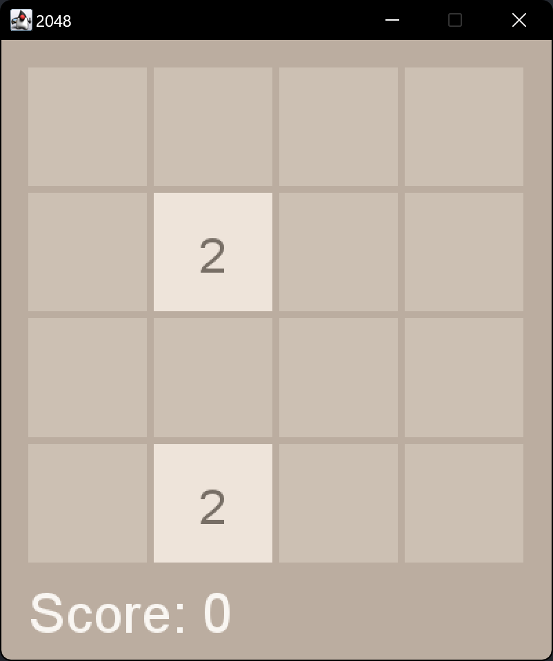
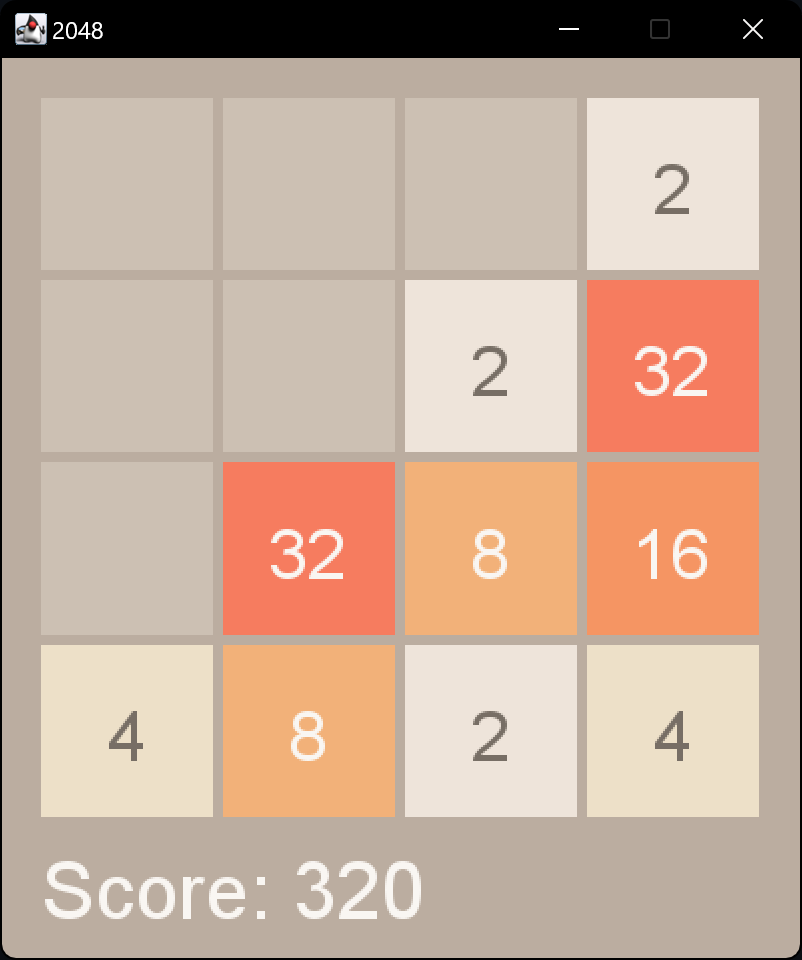
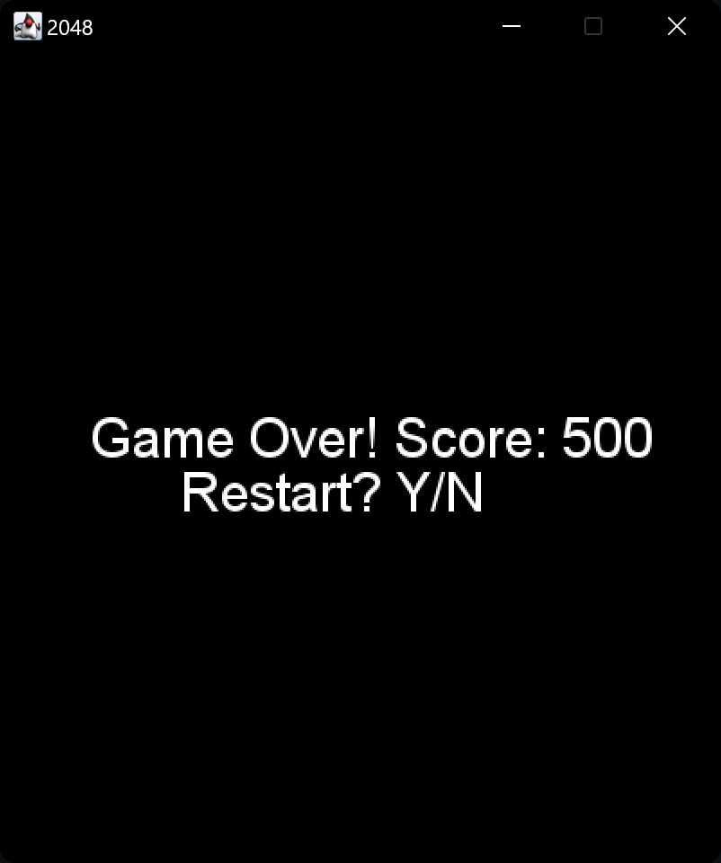

# 2048 Game

## Description
The **2048 Game** is a classic puzzle game that combines strategy, planning, and a bit of luck. Players slide numbered tiles on a 4x4 grid to combine them and create tiles with larger numbers. The goal is to reach the number **2048**, though players can continue playing to achieve even higher scores.

### Key Features:
- **Interactive Gameplay**: Simple controls to slide and merge tiles.
- **Dynamic Tile Generation**: Randomized appearance of new tiles with values of 2 or 4.
- **Score Tracking**: Real-time updates to your score based on successful merges.
- **Game Over Animation**: A visually appealing sequence when no moves remain.
- **Restart and Exit Options**: Restart the game at any time or exit after a game over.

---

## Screenshots

### Game Start

> **Description**: The game begins with an empty 4x4 grid, populated by two randomly placed tiles (2 or 4).

### Mid-Game

> **Description**: As you play, tiles merge and grow in value. The grid becomes progressively filled, requiring strategic moves to continue.

### Game Over

> **Description**: The game ends when no valid moves remain. Your final score is displayed with an option to restart or exit.

---

## Instruction Manual

### Objective
The objective of the game is to combine tiles of the same value until you create a tile with the value **2048**. You can continue playing to achieve higher scores.

### Controls
- **Arrow Keys** or **W/A/S/D**: Slide tiles in the chosen direction.
- **Y**: Restart the game after a game over.
- **N**: Exit the game after a game over.
- **Escape**: End the game immediately.

### How to Play
1. Start the game to initialize the grid with two tiles (2 or 4).
2. Use the controls to slide all tiles in one direction:
   - Tiles with the same value that collide will merge into one, doubling their value.
   - New tiles will appear at random empty locations on the grid.
3. Keep combining tiles to create higher values and maximize your score.
4. The game ends when the grid is full, and no valid moves remain.

---

## Code Structure

The code for the 2048 Game is written in **Scala** and follows a structured and modular approach. Below is a detailed breakdown of its components:

### Main Components

#### 1. **Game_Window Class**
   - The core class responsible for managing the game logic and user interactions.
   - Handles game initialization, updates, and rendering.

#### 2. **Grid Logic**
   - **Tile Movement**: Functions like `moveUp`, `moveDown`, `moveLeft`, and `moveRight` handle shifting and merging of tiles in their respective directions.
   - **Merge Mechanism**: Ensures correct merging of tiles while updating the score.
   - **Random Tile Placement**: Uses the `generateNewValue` method to randomly place a new tile (2 or 4) in an empty position.

#### 3. **Graphics Rendering**
   - **FunGraphics Library**: Utilized to create and manage the game window.
   - **Tile Drawing**: Draws tiles dynamically based on their values, ensuring proper colors and placement.
   - **Score Display**: Continuously updates and displays the current score at the bottom of the screen.
   - **Game Over Animation**: Creates an expanding black rectangle to signal the end of the game.

#### 4. **User Input Handling**
   - Implements a **KeyAdapter** to listen for keyboard inputs.
   - Maps user actions (WASD or arrow keys) to their corresponding functions.
   - Supports restarting or exiting the game through additional key bindings.

### How the Code Works
The game begins by initializing a 4x4 grid and adding two random tiles (values of 2 or 4). The user can use the keyboard to slide tiles in one of four directions (up, down, left, or right). When tiles with the same value collide, they merge to form a single tile with double the value. After every move, a new tile is generated in a random empty space.

The game logic continuously checks if valid moves are possible. If the grid is full and no merges are available, the game ends. The graphical interface, powered by the FunGraphics library, dynamically updates to reflect the current game state, including the score and tile layout. The game also features a "Game Over" animation and provides options to restart or exit.
